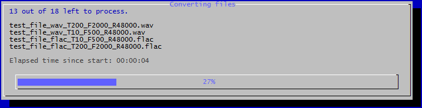
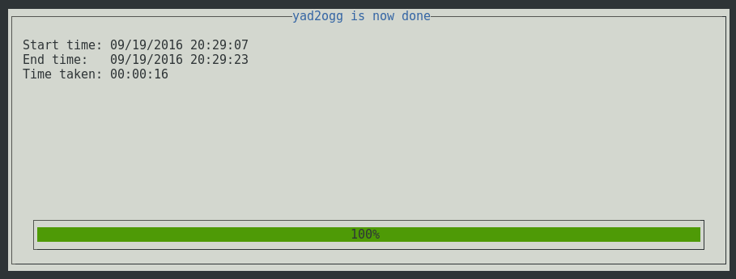

# yad2ogg

**[yad2ogg](https://github.com/idelsink/yad2ogg)** converts all the specified
audio files into ogg-vorbis format.  
This tool will process, copy and synchronize where needed
from the input directory to output directory.  
Based on the idea of [dir2ogg](http://jak-linux.org/projects/dir2ogg/).  

The name **yad2ogg** stands for: *Yet Another Directory to `ogg`*.

## Features

-   Concurrent conversion processes (use all the cores!)
-   File copy support. Copy over files from the source directory eg. `cover.jpg`
-   Fuzzy synchronization
-   Keep or get rid of the metadata
-   Logging, using [b-log](https://github.com/idelsink/b-log)
-   Simple user interface using `dialog`

## Examples

### Most basic usage

The following command will convert all the supported file types
from the input directory and place them in the output directory.

```sh
./yad2ogg -i input/ -o output/ -a
# or
./yad2ogg --input input/ --output output/ --ALL
```

### Example 01: test and demonstration

To test the tool and demonstrate it's behavior, take a look at
the [test script](./test/test.sh) in the [test](./test/) directory.  
This test will do the folowing:

-   generate some sample files
-   run the tool over these file in terminal mode
-   run the tool over these file in GUI mode

### Example 02: use case scenario

1.  I have a directory containing all sorts of music of all sorts of files.
2.  The source directory is called: `music`
3.  The output directory is called: `music_ogg`
4.  I want *all* files converted to `q 3`
5.  I have a quad core CPU
6.  I want to copy over all the `cover.jpg` files
7.  I want files that are gone in the source, deleted in the output directory
8.  I want to use the GUI and log to a file called: `example02.log`

```sh
#         2.        1.            4.   5.   1.  6.            7. 8. 8.
./yad2ogg -i music/ -o music_ogg/ -q 3 -j 4 -a -c 'cover.jpg' -z -g -l example02.log
# or in long options
#         2.             1.                  4.          5.       1.    6.                     7.     8.    8.
./yad2ogg --input music/ --output music_ogg/ --quality 3 --jobs 4 --ALL --copyfile 'cover.jpg' --sync --gui --logfile example02.log
```

## Suported filetypes

The supported file types at the moment are:

-   wav
-   flac
-   alac
-   mp3
-   ogg
-   m4a

Because in the core `ffmpeg` is used, a lot of file types are supported.
The setup for this tool is made in such a way that the converter can easily be
switched out and, if necessary switched out entirely on a file type basis.

## Installation

To install and use this tool,
make sure that you've installed the necessary dependencies.
Listed [here](#dependencies).

## Usage

```text
Usage: yad2ogg.sh [options]

    -a --ALL              Convert all supported file types
    -c --copyfile file    Copy files over from original directory to
                          destination directory eg. '*.cue or *.jpg'.
    -C --command          The default convert command. (default: ffmpeg)
                          When ffmpeg is not available, this can be set to avconv
    -f --filetypes type   File types to convert eg. 'wav flac ...'
    -f 'alac' --ALAC      convert files of type alac
    -f 'flac' --FLAC      convert files of type flac
    -f 'mp3'  --MP3       convert files of type mp3
    -f 'm4a'  --M4A       convert files of type m4a
    -f 'ogg'  --OGG       convert files of type ogg
    -f 'wav'  --WAV       convert files of type wav
    -g --gui              Use a simple UI instead of logging output to stdout. (dialog)
    -h --help             Show usage
    -i --input dir        Input/source directory (defaults to current directory)
    -j --jobs n           Number of concurrent convert jobs (default is 1)
    -l --logfile file     Log to a file
    -m --metadata         Don't keep metadata(tags) from the original files
    -o --output dir       Destination/output directory (defaults to input directory)
    -p --parameters param Extra conversion parameters
    -q --quality n        Quality switch where n is a number (default 5.0)
    -s --syslog param     Log to syslog "logger 'param' log-message"
                          For example: "-s '-t my-awsome-tag'" will result in:
                          "logger -t my-awsome-tag log-message"
    -v --verbose          Add more verbosity
    -V --version          Displays the script version
    -w --overwrite        Overwrite existing files
    -z --sync             Synchronize the output folder to the input folder.
                          If a file exists in the output folder but not in the
                          input folder, it will be removed.
                          Extensions will be ignored so that a converted file
                          will 'match' the original file
    -Z --sync-hidden      Same as --sync but includes hidden files/folders
```

### Concurrent processing

To speed up the conversion process, the user can specify a jobs parameter.
With this set, multiple instances of a converse process can be started.
If for example the user has an dual core processor,
it would better to use the `-j 2` option instead of the default `-j 1`.
This would result in a notable decrease of run time.

### File copy

When converting a complete music library,
it would be nice to transfer all the cover images with them.
This can come in handy when the cover image is not embedded in the tags.
So the `--copyfile file` is a command that will recursively find and copy over
files matching the `file` part of the command.
This means however that if the user has a subdirectory in an album directory,
like demonstrated below:

```text
music/
└── artist
    ├── album
    │   ├── art
    │   │   ├──random picture.jpg
    │   │   └──cover.jpg
    │   ├── 01 - first song.flac
    │   ├── 02 - second song.flac
    │   └── cover.jpg
```

And the command shown below is used:

```sh
--copyfile 'cover.jpg'
```

All the `cover.jpg` files will be copied over.
So the end result may look like this:

```text
output/
└── artist
    ├── album
    │   ├── art
    │   │   └──cover.jpg
    │   ├── 01 - first song.ogg
    │   ├── 02 - second song.ogg
    │   └── cover.jpg
```

In the command wildcards can be used.
To copy over all the `.jpg` files, use the command:

```sh
--cover '*.jpg'
```

### Fuzzy synchronization

When using the command demonstrated below, the output directory is checked
for 'counterpart' files in the input/source directory.
The 'counterpart' file is a file in the input/source directory
which has the same *name* and *path* as the file it checks to in the
output directory.
The fuzzy part is that the extension will not be checked.

```sh
-z --sync
# or
-Z --sync-hidden
```

If this 'counterpart' file cannot be found,
the file in the output directory is removed.  

### Conversion parameters

#### Quality

The quality switch for the converter.
By default this is `5.0`

> Most users agree -q 5 achieves transparency,
> if the source is the original or lossless.  
> taken from: <http://wiki.hydrogenaud.io/index.php?title=Recommended_Ogg_Vorbis>

```sh
-q 5.0
# or
--quality 5.0
```

### Extra converter parameters

To pass extra parameters to the converter, use the command shown below.

```sh
-p '-report'
# or
--parameters '-report'
```

This will result, in case of using `ffmpeg` in:

```sh
ffmpeg -i "input file" -acodec libvorbis -aq 5.0 -report "output file"
```

### Metadata

To remove the metadate(tags) from the output files, use the following.

```sh
-m
# or
--metadata
```

This will result in output files without any metadata from the original files.
This is not something that will be used by a lot of people,
but for completions sake this was put in.

### Verbosity / logging

With the `-v` or `--verbose` flag, more verbosity can be added to the tool.
This can be logged into a file or syslog
or print out to the terminal via `stdout`.  
Keep in mind that when using the GUI, logging to `stdout` is disabled.  
The logging library used is [b-log](https://github.com/idelsink/b-log)
for the people who are interested.

### User interface

#### Terminal

When running the tool over the files generated by the [test file](./test/test.sh),
see command below, the following output is created.

```sh
./yad2ogg.sh --input test/input/ --output test/output/ --jobs 2 -q 5.0 --ALL --overwrite --verbose
```


#### Graphical

For people that want something simple and clear,
a simple 'graphical' user interface is available.
This UI uses the tool `dialog`.  
To enable this, use the following command:

```sh
-g
# or
--gui
```

When using the GUI, logging via `stdout` is disabled.
Logging to a file is still possible.
When running the tool over the files generated by the [test file](./test/test.sh),
see command below, the following output is created.

```sh
./yad2ogg.sh --input test/input/ --output test/output/ --jobs 2 -q 5.0 --ALL --overwrite --verbose --gui
```





## Why did I make this

I didn't found a tool to suit my needs.
I wanted a tool to convert my music library to `ogg` for my phone etc.
I tried `dir2ogg` and I found the idea nice, but I didn't liked the fact
that it put the converted files in the same directory.
So I made this tool.  
I'm using it for my own library, so I want it to work!

## What does this tool need

### Permissions

For the input folder, read access is the minimum it needs.
For the output folder, it needs write access.
This is because it writes the converted files to that directory of course.

### Dependencies

At this moment it uses the following tools:

-   ffmpeg, for converting the files (or avconv if ffmpeg is not available)
-   dialog, for the GUI (if not installed, the terminal mode is still available)

## Warning

### Lossy to lossy

> Every time you encode with a lossy encoder, the quality will decrease.
> There's no way to gain quality back even if you transcode your 128kbps MP3
> into a 320kbps MP3 (or any other high-quality compression).
> Transcoding between lossy formats is therefore generally not recommended.
> The sound quality of the result will always be worse than
> the (lossy) source file.  
> Taken from <http://wiki.hydrogenaud.io/index.php?title=Transcoding>

### Data protection

This tool was made to modify files.
The idea is that the original files will be untouched.  
Of course, just like with every tool,
I'm doing my best to live up to this claim.
For safety reasons,
make sure that this tool only has *read* access to the input directory.
If in the event anything where to happen to this tool,
the input files will be safe.

## Tests

This tool was tested on the following systems.

-   *Ubuntu 12 LTS*: ffmpeg was not supported anymore. **Not recommended**
-   *Ubuntu 14 LTS*: Doesn't work out of the box. **See below**
-   *Debian 7*: ffmpeg was not supported anymore. **Not recommended**
-   *Debian 8*: Doesn't work out of the box. **See below**
-   *Fedora 23*: All works fine after installing the dependencies.

### For Ubuntu 14 LTS

Add the repository for ffmpeg,
but first read [this](https://launchpad.net/~mc3man/+archive/ubuntu/trusty-media).

```sh
sudo add-apt-repository ppa:mc3man/trusty-media
```

Then install it with:

```sh
sudo apt-get update
sudo apt-get install ffmpeg
```

### For Debian 8

`ffmpeg` is not available by default.
This can be fixed by either installing `ffmpeg` from another repo
or to build it from source.
Another option is to install `avconv`(libav) and use `avconv` as default.

Use the following command:

```sh
-C 'avconv'
# or
--command 'avconv'
```

Remember that the test is based on a special feature of `ffmpeg`.
So if you choose the use `avconv`, the test will not work.
The workings of the tool itself will be fine.

### Running test

I tested this tool a few times on my own music collection.
This collection is about 450GB in mostly `flac`.

The server I tested this on has a Intel Pentium G3220 dual core processor,
clocked at 3.00GHz.
The library/input sat on a NAS attached to my network
and mounted on this server.
The output was a external hard drive attached to the server.
I ran the tool once in terminal mode and once in GUI mode.
For the terminal I got the following results.

```sh
./yad2ogg.sh -i /mnt/music_nas/ -o /mnt/dataDrive/music_ogg/ --ALL -j 2 -c 'cover.jpg' -z -l terminal_01.log -q 3.0 -v
```

This resulted in the following output:

```text
[2016-07-10 00:44:43.533][INFO  ][main:109] looking for files with the filetypes: wav flac alac mp3 ogg m4a
[2016-07-10 00:44:53.582][NOTICE][process_gui:867] Elapsed time: 00:00:10 | 0% | looking for files to convert |
...
[2016-07-10 00:46:03.672][NOTICE][process_gui:867] Elapsed time: 00:01:20 | 0% | looking for files to convert |
[2016-07-10 00:46:05.621][INFO  ][main:110] starting the conversion process(es)
...
[2016-07-10 00:46:13.874][NOTICE][process_gui:867] Elapsed time: 00:01:30 | 0% | Converting files | 12625 out of 12630 left to process.
...
[2016-07-10 11:54:15.364][NOTICE][main:112] yad2ogg is now done
[2016-07-10 11:54:22.923][NOTICE][process_gui:897] yad2ogg is now done
[2016-07-10 11:54:22.933][NOTICE][process_gui:898] Start time: 07/10/2016 00:44:43
[2016-07-10 11:54:22.943][NOTICE][process_gui:899] End time:   07/10/2016 11:54:22
[2016-07-10 11:54:22.957][NOTICE][process_gui:900] Time taken: 11:09:39
```

For the GUI I got the following results.

```sh
./yad2ogg.sh -i /mnt/music_nas/ -o /mnt/dataDrive/music_ogg/ --ALL -j 2 -c 'cover.jpg' -z -l gui_01.log -q 3.0 -v --gui
```

This resulted in the following output:

```text
[2016-07-10 12:38:45.832][INFO  ][main:109] looking for files with the filetypes: wav flac alac mp3 ogg m4a
[2016-07-10 12:38:55.003][NOTICE][process_gui:867] Elapsed time: 00:00:10 | 0% | looking for files to convert |
...
[2016-07-10 12:40:45.006][NOTICE][process_gui:867] Elapsed time: 00:02:00 | 0% | looking for files to convert |
[2016-07-10 12:40:48.955][INFO  ][main:110] starting the conversion process(es)
...
[2016-07-10 12:40:55.026][NOTICE][process_gui:867] Elapsed time: 00:02:10 | 0% | Converting files | 12607 out of 12630 left to process.
...
[2016-07-11 00:09:16.734][NOTICE][main:112] yad2ogg is now done
[2016-07-11 00:09:17.009][NOTICE][process_gui:897] yad2ogg is now done
[2016-07-11 00:09:17.015][NOTICE][process_gui:898] Start time: 07/10/2016 12:38:45
[2016-07-11 00:09:17.021][NOTICE][process_gui:899] End time:   07/11/2016 00:09:16
[2016-07-11 00:09:17.026][NOTICE][process_gui:900] Time taken: 11:30:31
```

So with this test, I tested if it could handle my 'large' library.
I also tested the time it took and if the usage of the GUI had any influence.
For the results `11:09:39` vs `11:30:31` is not a bad outcome.
Remember that this is over the network, so your mileage may very.

## Feedback

Feedback is great!  
If you want to do anything with this tool, do it.
Clone it, modify it, break it, repair it ... whatever suits your needs.

If you liked this tool, you know where the 🌟 button is.  
(that's a Glowing Star Unicode character,
if it doesn't show correctly \[U+1F31F\])

## License

> You can check out the full license [here](./LICENSE)

This project is licensed under the terms of the **MIT** license.
